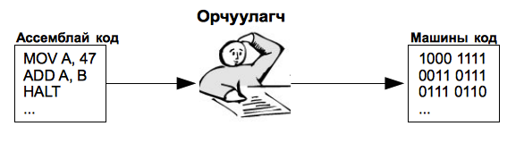

# Компютертэй ойлголцох

Компютертэй ойлголцох нь амаргүй ажил юм. Хэрэв хүмүүс бид хоорондоо ярьдаг шиг компютертэй харилцдаг бол хялбар байхсан. Гэвч энгийн хэлээр компютерт заавар өгөхөд хоёрдмол утгатай зүйлс их гарах болно. Хүмүүс олон салаа утгатай зүйлсийг ойлгодог бол компютер тийм биш,  компютер яг таг тодорхой зааврыг л ойлгоно. Тэд тоогоор "сэтгэдэг" юм. Компютерт хүний яриаг орчуулах, хөрвүүлэх шийдлүүд бий боловч хүн болон компютер хоорондоо ярилцаад бүрэн ойлголцох хэмжээнд хараахан хүрээгүй л байна.

Тэгэхээр яаж компютертэй ойлголцох вэ? Анх програм зохиогчид тоон заавраас тогтох машинд зориулсан хэлийг бүтээсэн бөгөөд энэ тоон дарааллыг компютер ойлгож гүйцэтгэдэг байв. Энэ хэл дээр бичигдсэн програм нь дараах байдалтай харагдана.

```
1010 1111
0011 0111
0111 0110
..
```

гэх мэт хэдэн зуун заавар.

Машины “тоон хэл” дээр програм бичих нь маш хүнд ажил байсан учраас хожим нь инженерүүд ассемблай хэлийг бүтээсэн. Энэ нь тоон хэлийг бага зэрэг сайжруулан нэг тоон командад нэг үг харгалзуулсан хэлбэр байв. Үүнийг ассемблай хэл гэж нэрлэсэн байна. Ассемблай хэлэнд бичсэн програм нь дараах байдалтай харагдана.

```
Ассемблай програм    Харгалзах тоон код
MOV A,47             1010 1111
ADD A,B              0011 0111
HALT                 0111 0110
...
```

гэх мэт хэдэн зуун заавар үргэлжлэнэ.



Дараа нь нэгэн програм зохиогч ассемблай програмыг машины тоон хэл рүү хөрвүүлэгч програмыг бүтээсэн байна. Уг хөрвүүлэгч програмаа _ассемблер_ гэж нэрлэсэн байна. Энэхүү ассемблер програм нь цаашдын бүх програмчлалын хэлний эхлэл байсан гэж үздэг.

Ассемблай хэлнээс улбаалан орчин үеийн олон хэл бүтээгдсэн юм. Эдгээр хэлүүд ашиглахад улам хялбар, тохиромжтой, бүтээмж өндөртэй болж програм зохиогчдын ажлыг үлэмж хөнгөвчилдөг болсон.

Орчин үеийн өндөр бүтээмжтэй хэлний нэг бол Google компаниас 2009 онд гаргасан Go нэртэй хэл юм. Go хэл нь маш энгийн бөгөөд  хүчирхэг хэл болж чадсан. Зохиомжийн хувьд програм хангамжийн инженерчлэлийн хамгийн сайн арга, туршлагуудыг агуулсан, өндөр бүтээмжтэй хэл юм.

Go хэл нь Windows, Linux, Unix, OS X зэрэг олон төрлийн платформ дээр ажиллах боломжтой байдаг нь хөгжүүлэгчдийн сонирхолыг татах нэг шалтгаан болж байна.

