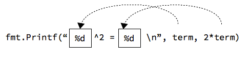

# Стандарт оролт, гаралт

Дэлгэц ба гар нь компютерт мэдээллийг оруулах, гаргах үндсэн төхөөрөмжүүд бөгөөд эдгээрийг стандарт оролт/гаралт гэж хэлдэг.

## Мэдээлэл хэвлэх

Програмын үр дүнг дэлгэц дээр хэвлэн харуулахад стандарт сангийн `print()`, `println()` функцүүдийг ашиглаж болно.

```go
println(“Hello World!”)
```

`println()` функц нь текст мөрийн араас шинэ мөрийн тэмдэгтийг \('\n'\) оруулж хэвлэдэг.

`fmt.Printf()` функц нь мэдээллийг тодорхой форматтайгаар дэлгэцэнд гаргахад ашиглагддаг.

```go
var term int = 15;
fmt.Printf("%d^2 = %d\n", term, 2 * term)
```

Дээрх кодын хэсэг нь дэлгэц  дээр `15^2 = 30` гэсэн мэдээллийг хэвлэнэ. Энд `%d` тэмдэгтийг орлуулагч тэмдэгт гэнэ. Функцийн эхний параметрт бичигдсэн мөр нь нэг бүрчлэн хэвлэгдэнэ. Гэхдээ энд орлуулагч ашигласан учраас `term` хувьсагчийн утга нь эхний `%d`-н байранд, `2 * term`  утга нь дараагийн `%d` байранд гэх мэт орлуулагдан хэвлэгдэнэ.



`fmt.Printf()` функцийн ерөнхий хэлбэр нь дараах байдалтай:

```go
fmt.Printf(format, expression-1, expression-2, ...)
```

Хэлбэршүүлэгч `format` нь юуг, яаж хэвлэхийг заана.  `expression-1`, `expression-2` нь хэвлэгдэх илэрхийллүүд байна.

Дараах жишээ програмд дэлгэрэнгүй үзүүлэв.

```go
package main
import "fmt"

func main() {
    term := 3 * 5 // хувьсагч зарлаад утга олгох
    fmt.Printf("%d^2 = %d\n", term, 2*term)
}
```

## Өгөгдөл оруулах

`fmt` сангийн `Scanf` функцийг өгөгдөл оруулахад ашиглаж болно. Энэ функц нь `Printf`-тэй адилхан зарчмаар ажилладаг, ялгаа нь өгөгдөл оруулна.

```go
fmt.Scanf(format, &variable1, &variable2 . . .)
```

`format` нь `Printf` функцийн хэлбэршүүлэгчтэй төстэй. Хувьсагчдын нэрний өмнө амперсанд `&` тэмдэгт тавих хэрэгтэй. Энэ нь хувсагчдын утгыг өөрчлөх боломжийг олгоно.

Дараах жишээнд `Scanf` функцийг ашиглан тоон өгөгдөл оруулж байна.

```go
package main
import "fmt"

func main() {
    var value int // хувьсагч зарлах

    fmt.Print("Утга оруул: ")
    fmt.Scanf("%d", &value)

    fmt.Printf("%d * 2 = %d\n", value, value * 2)
}
```

Энэ програм нь гараас оруулсан тоог 2-оор үржүүлж үр дүнг хэвлэнэ.

Програмыг ажиллуулвал дараах байдалтай харагдана:

```sh
Утга оруул: 12
12 * 2 = 24
```

Хэрэв `“Утга оруул:”` гэхийг `“Утга оруул\n:”` гэж соливол \(ард нь шинэ мөрийн `\n` тэмдэгт нэмсэн\) үр дүн дараах байдалтай болно:

```sh
Утга оруул:
12
12 * 2 = 24
```


