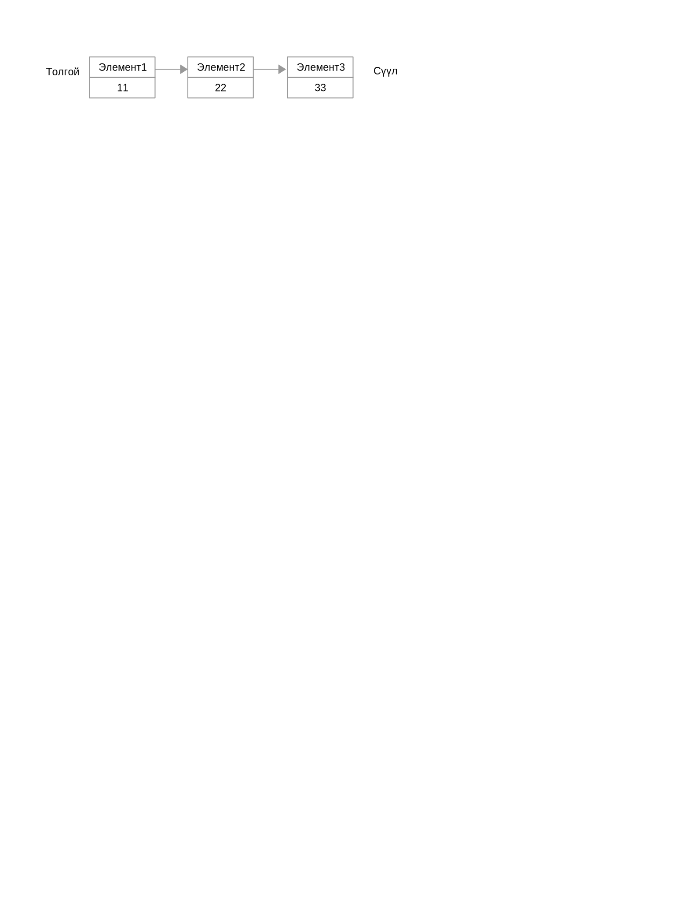

# Жагсаалт

Жагсаалт нь нэг нь нөгөөгийн араас залгагдсан обектуудын гинжин цуваа юм. Go хэлний `container/list` пакет нь давхар холбоост жагсаалт төрлийг агуулдаг. Давхар холбоост жагсаалтын нэг элемент нь урд болон арын элементээ заасан холбоостой байдаг.



Жагсаалтад элемент нэмэх, түүний элементүүдээр хэрхэн гүйхийг дараах програмд харуулав:

```go
package main

import (
  "fmt"
  "container/list"
)

func main() {
    var x list.List
    x.PushBack(1)
    x.PushBack(2)
    x.PushBack(3)

    for e := x.Front(); e != nil; e=e.Next() {
        fmt.Println(e.Value.(int))
    }
}
```

Энд харуулснаар `PushBack()` функцийг ашиглан 1, 2, 3 тоон утгуудыг жагсаалтад нэмж байна. Дараа нь жагсаалтын элементүүдээр давтаж байна, ингэхдээ эхний элементийг `Front()` функцээр олоод түүнээс цааш `Next()` функцээр дараа дараагийн элементүүдийг олж байна. Энэ давталтыг `nil` утга  буюу жагсаалтын төгсгөл хүртэл гүйцэтгэнэ.
